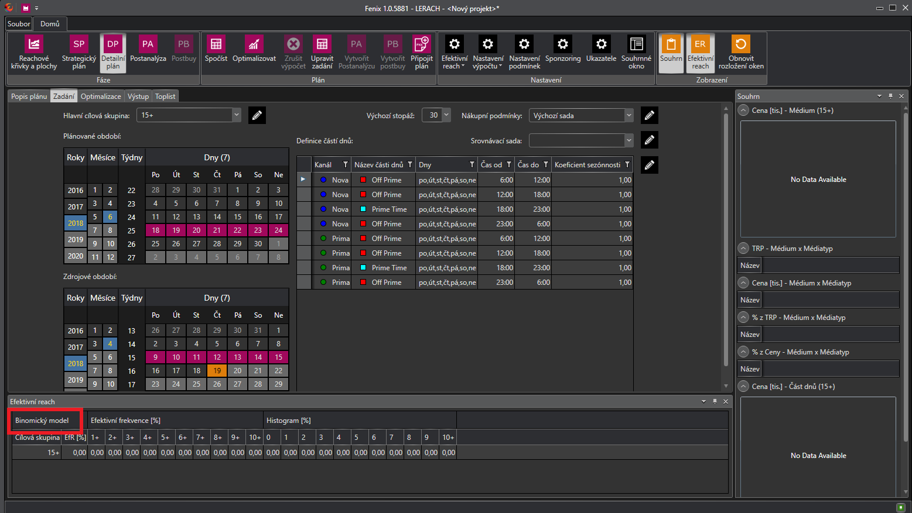

# Verze 1.0.5868

## Možnost přepínaní mezi formátem času 0 - 24 a 6 - 30 
Do ukazatelů v Detailním plánu přidána možnost přepnutí mezi formátem času 0 - 24 a 6 - 30 hodin dle programové půlnoci.

## Informace o vybraném typu výpočtu v Detailním plánu
V tabulce efektivní reach přibyla informace o vybraném typu výpočtu: binomický nebo exaktní. Název modelu výpočtu se exportuje také do Excelu.

## Detailnější identifikace důvodu neúspěšného otevření .fnx
Fenix nyní rozeznává, zda je otevíraný .fnx soubor prázdný, poškozený, uzamčený, nepřístupný nebo pokud byl vytvořený na novější verzi aplikace.

## Hromadná práce s adekvátními bloky
S adekvátními bloky je nyní možné pracovat hromadně. Adekvátní bloky se vyhledají pro všechny označené řádky.

## Pamatovaní nastavení exportu Detailního plánu
V detailním plánu se nyní pamatuje naposledy použité nastavení exportu do Excelu.
