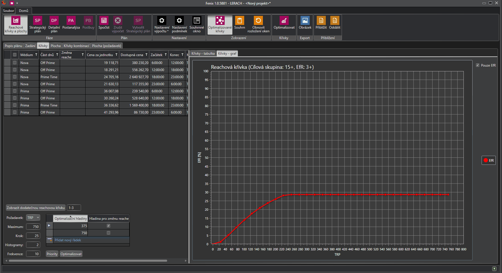

# Verze 1.0.5881

## Upozornení uživatele v případě problému s databázovými soubory
V případe problémů při práci s databázovými soubory bylo upraveno chování aplikace tak, aby v těchto případech nepadal na neošetřené výjimky, ale upozornil uživatele na chybovou hláškou. 

## Možnost v Reachových křivkách přizobrazit dodtečnou křivku
V Reachových křivkách je nově možné nadefinovat a přizobrazit další reachovou křivku navíc, například ke křivkám 3+ si uživatel může zobrazit křivku reache 3-9.

## Vylepšení importu plánu s Excelu 
V Detailním plánu byly přidány drobná vylepšení importu plánu s Excelu, například byly doplněny popisky polí a vylepšena práce s formáty datumů a časů.

