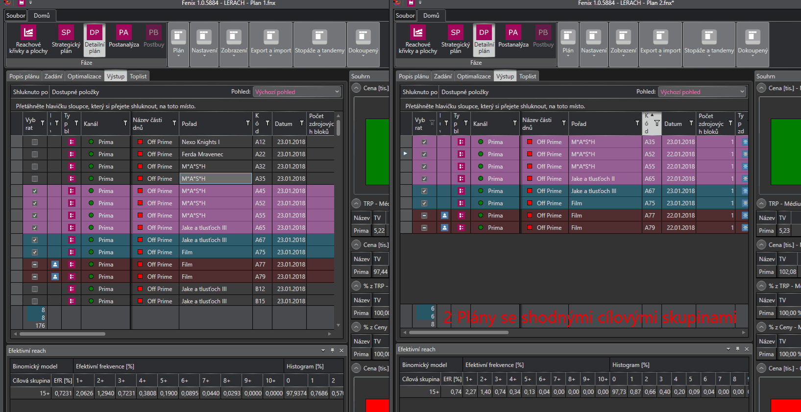
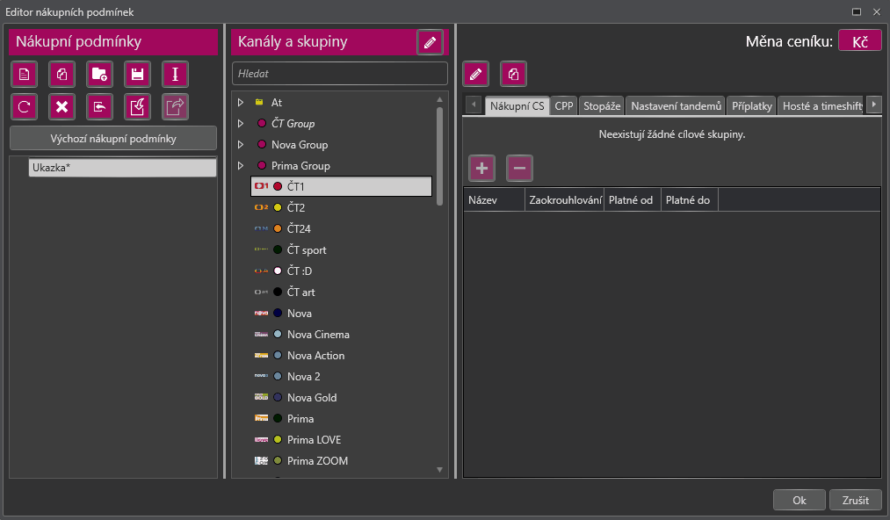

# Verze 1.0.5883

## Přepracování funkce připojit plán 
Funkce připojit plán v Detailním plánu byla kompletně přepracována. Nově slouží především k sečtení reache několika kampaní, a proto nedochází k přepočtu. Podmínkou jsou pouze shodné cílové skupiny. Do aktuálního plánu se vloží všechny bloky z připojovaného plánu i s jejich stavem – Vybraný/Zafixovaný/Zakázaný/Nevybraný. Při připojení stejného plánovaného období dochází ke vzniku duplicitních bloků. Reach a investované prostředky se počítají ze všech vybraných bloků obou plánů.

## Možnost kopírovat nákupní podmínky z jedné stanice/média do více stanic/médií najednou
Nově je možné zkopírovat nákupní podmínky z jedné stanice/média do více stanic/médií najednou a to buď kompletně, nebo pouze jejich nákupní cílové skupiny. Navíc je možné kopírovat je navzájem mezi stanicemi a skupinami stanic.

