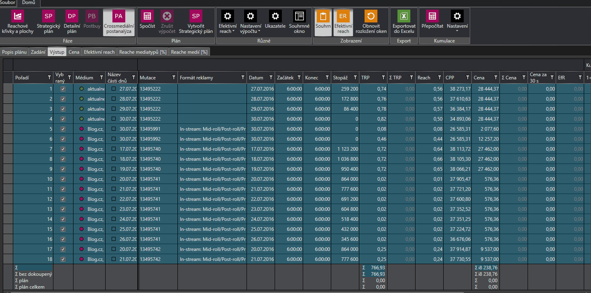
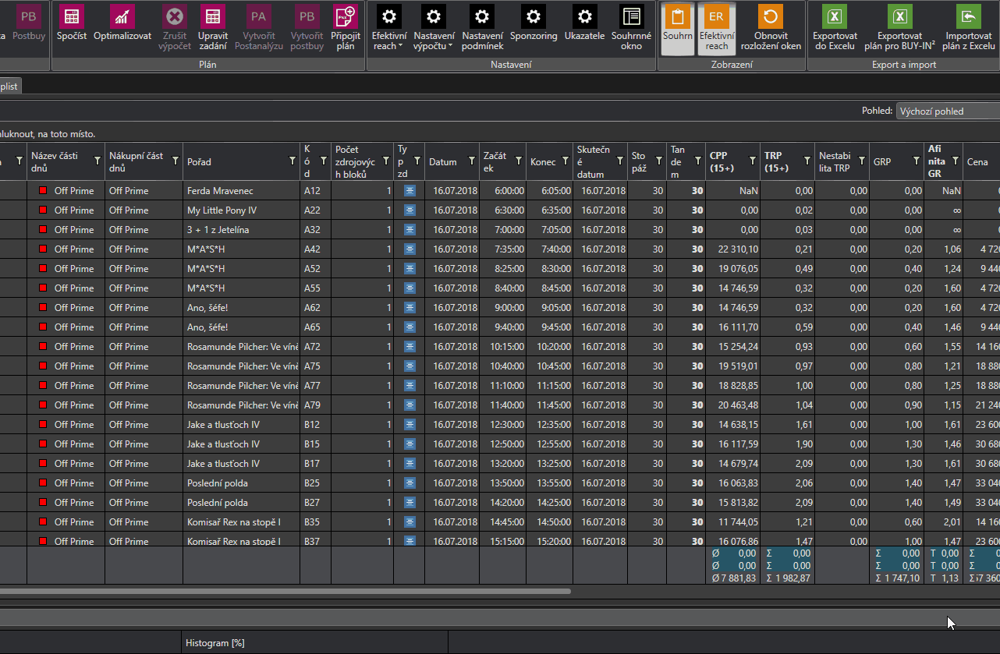

# Verze 1.0.5918

## Export do Excelu v Crossmediální postanalýze
V Crossmediální postanalýze je nově možné exportovat do Excelu tabulky reache mediatypů a tabulky reache médií.

## Vylepšení importu plánu z Excelu
Do importu plánu z Excelu byl přidán druhý náhled importovaného excelu. Ten představuje konec tabulky. Zelený řádek v horní tabulce určuje od kterého řádku bude import začínat a červený v dolním náhledu zase určuje, kde bude import končit. Naimportují se tedy pouze řádky mezi nimi. 
Pro větší přehlednost byla přidána informace o celkovém počtu řádků v importovaném souboru i do okna importéru. Oba počty přeskočených řádků (od začátku i od konce) lze nyní editovat ručně .  

