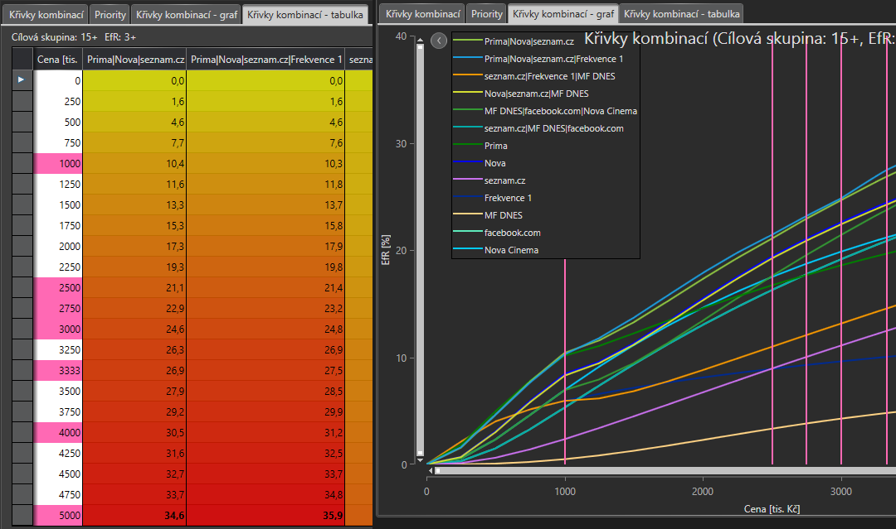
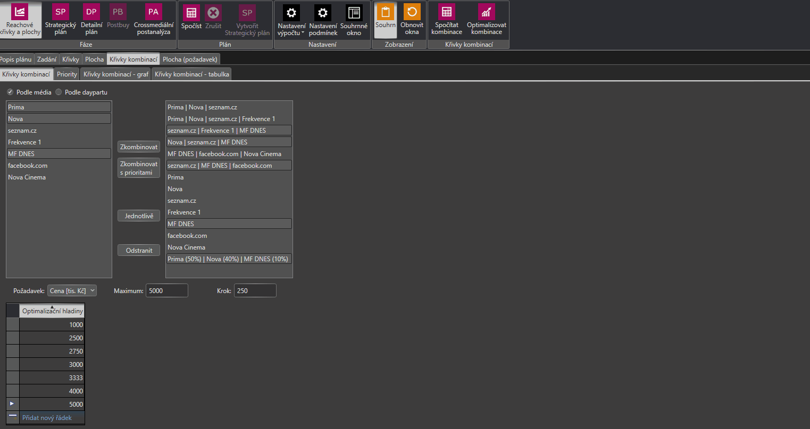

# Verze 1.0.5937
17.7.2018

## Zvýraznění optimalizovaných hladin
Do optimalizovaných křivek kombinací bylo přidáno zvýraznění optimalizačních hladin a to jak do grafu tak do tabulky. 
Hladiny, které neodpovídají kroku jsou do tabulky přidány jako další řádek.

## Zachování kombinací
Při přepočtení reachových křivek dochází k zachování nastavených reachových kombinací. 
Pokud došlo ke změně mediadaypartů, zachovají se pouze ty, které se vyskytují i v novém plánu.
 

