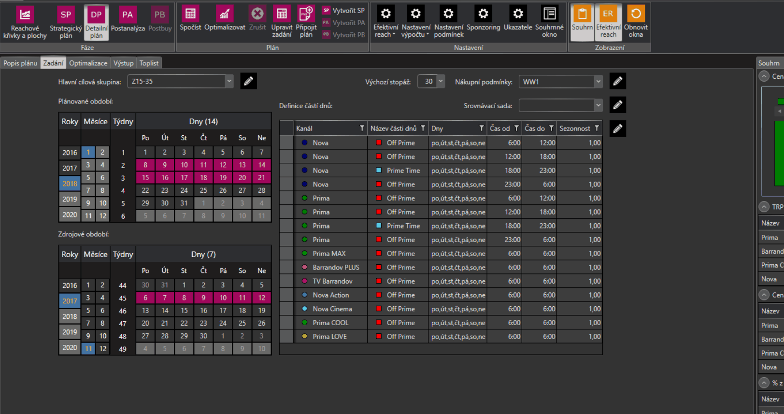
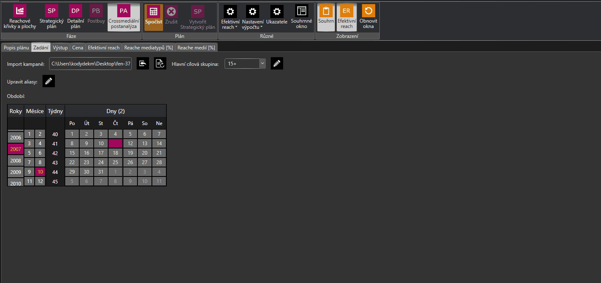

# Verze 1.0.5960
16.8.2018

## Vytvořit Strategický plán z Detailního plánu
Nově je možné ze spočteného Detailního plánu s vybranými bloky vytvořit Strategický plán.  
Z detailního plánu se přeberou veškerá nastavení - Období, Vybrané dayparty, cílová skupina, nákupní podmínky, efektivní reach i podmínky.
Ve strategickém plánu nedochází k optimaliazaci. Fenix pouze sečte Ceny vybraných bloků pro jednotlivé mediadayparty a tyto hodnoty přenese do Strategického plánu. 
Efektivní reach je dopočten podle přenesených investovaných prostředků(ceny).
 

## CMPA výpočet i přes chybějící data
Při výpočtu Cross-medialní postanalýzy je nově možné provést výpočet i v případě, že pro všechny media ve vstupním souboru nejsou dostupná data. 
V takovém případě je uživatel dotázán, zda chce provést výpočet i bez těchto dat.
 
