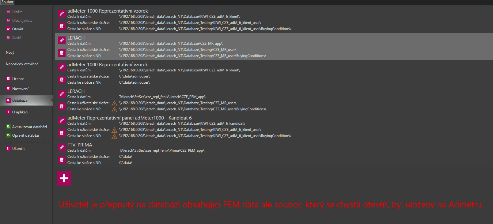
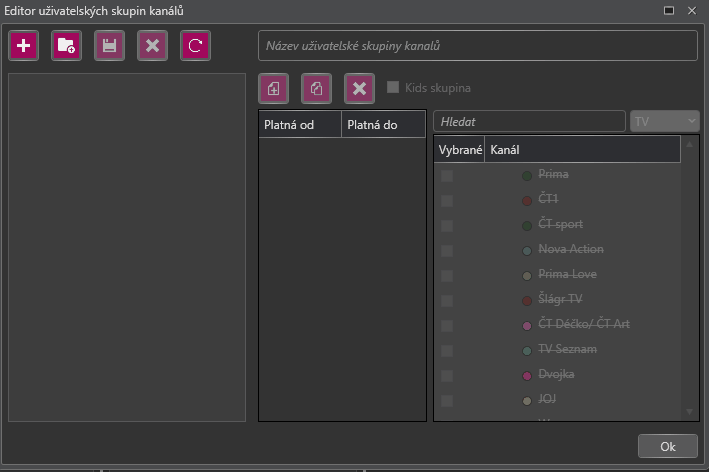

# Verze 1.0.5963
27.8.2018

## Otevírání uloženého plánu na datech, na kterých byl naposledy otevřen
Při otevření FNX je uživatel dotázán, zda ho chce otevřít na datech, na kterých bylo naposledy upraveno. 
V případě, že zvolí ano dojde k přepnutí na databázi, na které bylo FNX naposledy uloženo.
Pokud se tyto cesty nenachází v seznamu databází, jsou tam automaticky přidány.
 

## Výběr mediatypu a multiselect při vytváření uživatelské skupiny stanic
Do editoru uživatelských skupin stanic bylo přidáno pole pro výběr mediatypu skupiny. 
Zobrazí se pouze média vybraného mediatypu. 
Také byla přidána funkce multiselectu. Klávesa Insert označí všechna vybraná média, Delete odznačí a Mezerník změní stav na opačný.

## Rozšíření hlášky o neexistujících blocích pro stanice v bundlu
Pokud pro některou ze stanic v bundlu chybí v nastaveném plánovaném období bloky, je o tom uživatel informován hláškou 
a nově i seznamem stanic v postiženém řádku bundle. 
 
