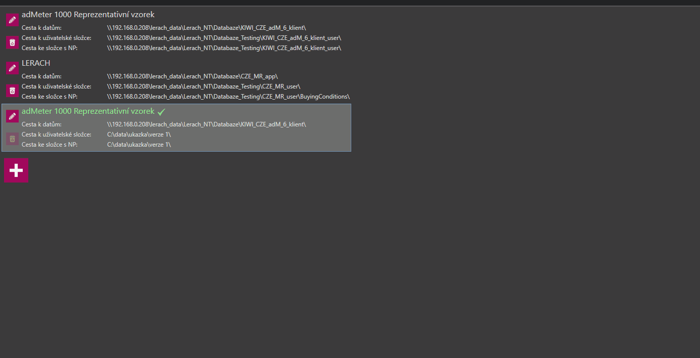

# Verze 1.0.5964
3.9.2018

## Vylepšení okna pro výběr databáze
 Nově je aktuálně načtená databáze jasně označena. Také byla přidána kontrola při editaci aktuální databáze. 
 Ta dá uživateli na výběr zda, chce cesty k aktuální databázi změnit, nebo vytvořit jejich upravenou kopii.
 

