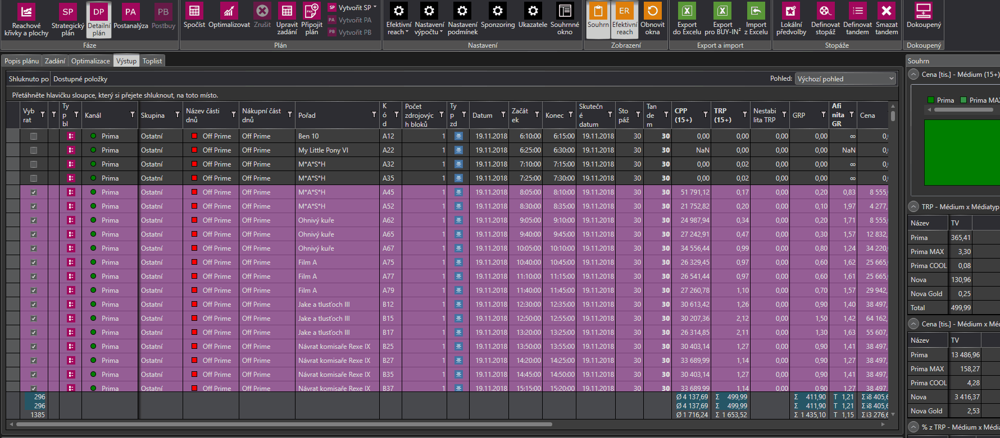
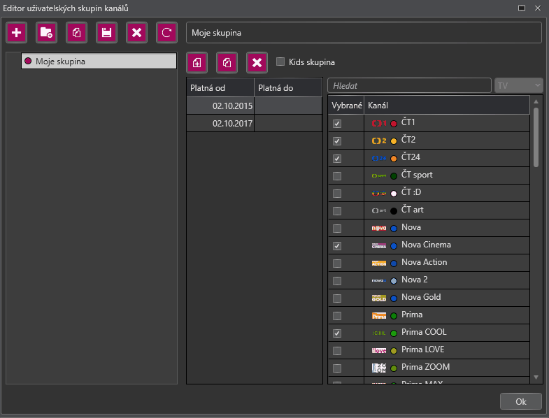

# Verze 1.0.5984
1.10.2018

## Výběr typu požadavku při přechodu z Detailního plánu do Strategického
 Při vytváření Strategického plánu z Detailního plánu má uživatel nově na výběr jaký typ požadavku se přenese. 
 Na výběr jsou Cena[tis.] GRP a TRP. Hodnota vybraného požadavku se přesně přenese do Strategického plánu.
 

## Kopírování uživatelských skupin kanálů
 V Editoru uživatelských skupin kanálů bylo přidáno tlačítko kopírovat, umožňující vytvořit přesnou kopii vybrané skupiny kanálů.
 
