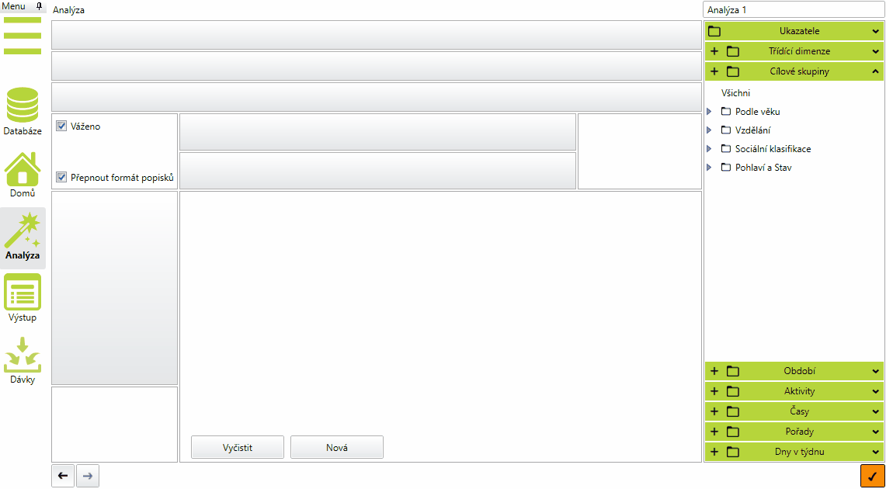
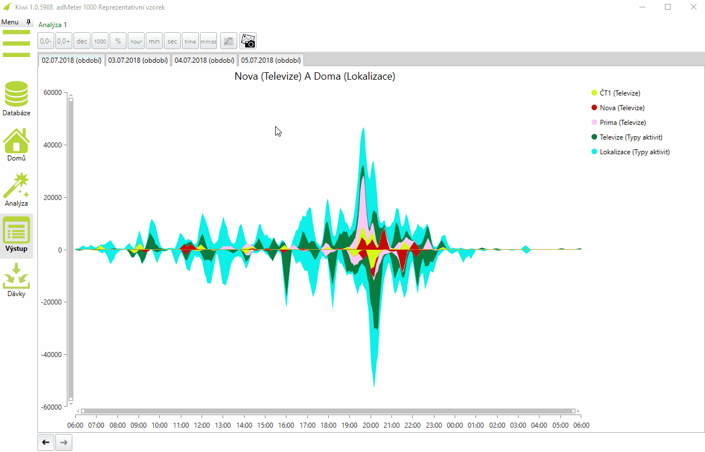

# Verze 1.0.5988
15.10.2018

## Vylepšené optimalizace detailního plánu
Do nové optimalizace detailního plánu, kterou jsme vám přinesli minulý týden přibylo několik vylepšení.
Pokud nyní vytvoříme Detailní plán z optimalizovaného strategického, převezme se nastavení priorit automaticky. 
V detailním plánu byl vylepšen algoritmus optimalizace bundlů. Při optimalizaci s nimi nyní dostáváme vyšší 
hodnoty efektivního reache. Použité priority se také nově exportují do excelu. 

## Kiwi - Vytváření složek
V oknech výrazů lze nově vytvářet, přejmenovávat a mazat uživatelské složky. Novou složku vytvoříme 
kliknutím na ikonou Nová složka, tažením myši do ní můžeme výrazy přetahovat a klávesou Delete složku 
smazat. Složky se ukládají spolu s projektem a každý projekt má své vlastní složky.

## Kiwi - Záložky pro období v grafu přelivů
Do grafu Přelivů byla přidána funkce, která zobrazuje graf v záložkách pro každé vybrané období zvlášť

