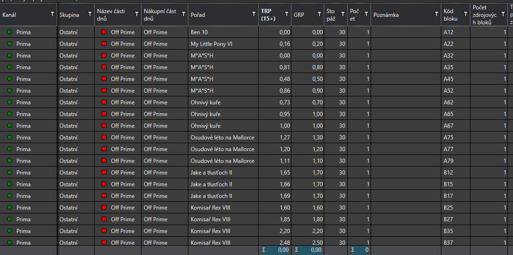
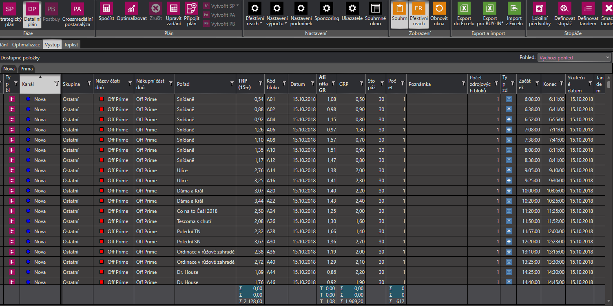

# Verze 1.0.6007
19.11.2018

## Hromádná úprava v Detailním plánu
 
V detailním plánu byla přidána možnost editovat více řádků najednou. Ručně psané údaje se vepíší do všech označených řádků.

## Zrychlení optimalizace Detailního plánu
 
Otpimalizace na Reach v deatilním plánu byla zrychlena

## Ukládání řazení do pohledů

Do pohledů se nyní ukládá i příznak řazení. Tedy sloupce podle kterých je výstup vertikálně řazen.

