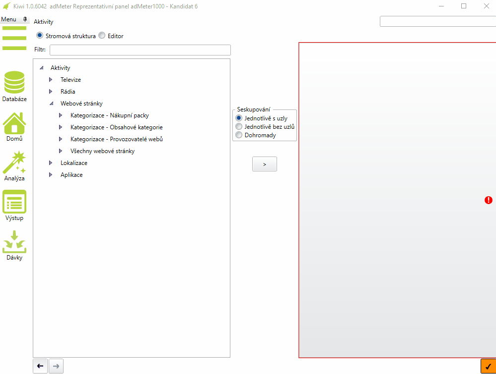
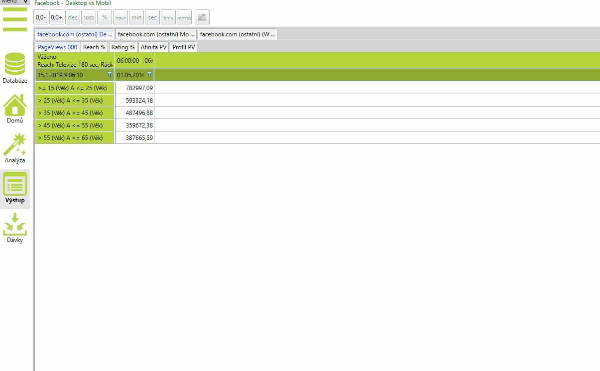

# Verze 1.0.6041
15.01.2019

## Kategorizace webù

Webové stránky jsou v Kiwi novì roztøídìny do nìkolika kategorií. Jsou to Nákupní packy, Vlastníci, Žánry a kategorii 
Všechny webové stránky, která obsahuje pùvodní kompletní seznam webových stránek. Z dùvodu úpravy stromu aktivit 
byl v Editoru Aktivit pøidán pøepínaè umožòující vybírat mezi skupinami médií a jednotlivými médii.  

## Maximum v bundle

Ve Strategickém plánu lze nyní nastavit Maximální TRP/GRP/Cena na skupinì stanic pouze do výše povolené bundlem. 
Jakákoli vyšší èástka se opraví zpìt na maximální hodnotu, kterou je možné zadat pøi dodržení rozdìlení bundle skupiny stanic. 

## Zápis parametrù analýzy pøi exportu do excelu

Parametry analýzy v Kiwi, které se se dosud zapisovaly pøi exportu do Excelu pouze do jména listu se nyní exportují do prvního øádku tabulky.

