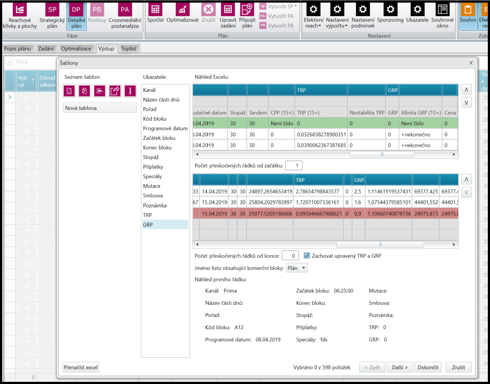
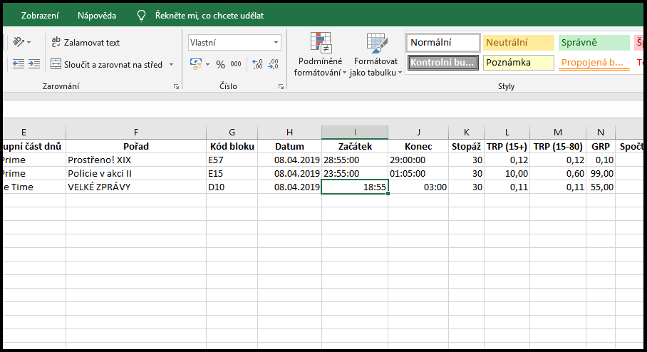
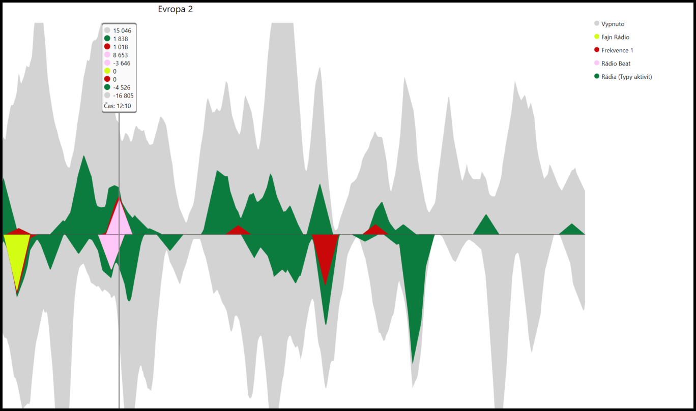

# Verze 1.1.15
26.03.2019

## Fenix - Zachování změny TRP a GRP
Při importu z excelu do Detailního plánu je nově možnost vybrat, zda-li má aplikace zachovat uživatelem změněné hodnoty TRP a GRP (V tabulce označené kurzívou), nebo se mají přepočítat na výchozí spočtené hodnoty (případně je přenačíst hodnotami z excelu).

## Fenix - Formát času v Detailním plánu
Při importu excelu do Detailního plánu je nově možné zadávat časy začátku a konce bloků ve formátech: 06-06, 06-30 a dlouhém zápisu spolu s datem: 1.1.2000 06-06

## Kiwi - TrackBall u přelivů
V Analýze přelivů se v grafu nově zobrazují hodnoty jednotlivých položek v "TrackBallu". Pro vyšší přehlednost je zvýrazněna nulová osa X.

