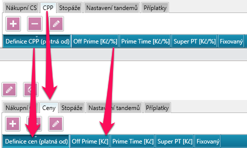
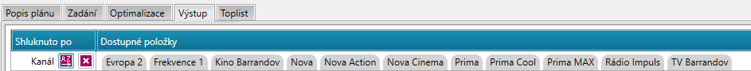

# Verze 1.1.4
25.02.2019

## Změny v užívání fixní ceny
Byl upraven způsob, jakým se zachází s fixní cenou. Nově se u médií, které mají fixní cenu použitou, vypní právě tato cena do sloupce Cena, ne 
tedy CPP, jak tomu bylo dříve. S tím souvisí i úprava popisků sloupců v Nákupních podmínkách. 

## Řazení shluků
Shlukly ve výstupu Detailního a Strategického plánu lze nyní řadit abecedně, popřípadě 0-9 u číselných hodnot, pomocí nové ikony. 

## Rozdíly ve složení skupiny přehledněji
Pokud při výpočtu dojde k neshodě mezi složením skupiny a složením skupiny v databázi je uživatel upozorněn vylepšenou hláškou, která obsahuje
pouze rozdílná média, ne tedy celý nepřehledný seznam, jako dříve.

## Kiwi - Vylepšené vyhledávání v editoru aktivit
Vyhledávání v Editoru Aktivit nyní nalezne všechny hledané výskyty média.

