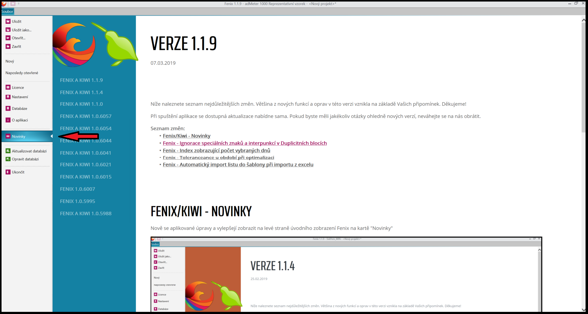

# Verze 1.1.9
07.03.2019

## Fenix/Kiwi - "Novinky"
Nově aplikované změny a vylepšení se zobrazují v levém menu jako „Novinky“.

## Fenix - Vynechání speciálních znaků a interpunkcí v Duplicitních blocích
Došlo k úpravě ve vyhledávání duplicitních bloků. Nově se vyhledávají pořady pouze podle alfanumerických znaků. Specialní znaky a interpunkce jsou ignorovány.
Pokud je na například na konci názvu bloku "/" a u jiného bloku stejného názvu není, tak jsou považovány za totožné.

## Fenix - Index zobrazující počet vybraných dnů v měsíci
Při výběru dnů, týdnů, měsíců, případně celého roku se vedle čísla měsíce zobrazuje i počet dní vybraných v tomto měsíci. 
<video width="1024" height="680" src="https://kiwifenix.lerach.cz/data/fenix_07_3_dny.mp4" type="video/mp4" controls></video>

## Fenix - Toleranceance u období při optimalizaci
Při nastavování "Priority za období" v optimalizaci detailního plánu lze nově nastavit toleranci u období v %.
<video width="1024" height="680" src="https://kiwifenix.lerach.cz/data/fenix_07_3_tolerance.mp4" type="video/mp4" controls></video>

## Fenix - Automatický import listu do detailniho planu při importu z excelu
V okně "Šablony" u detailního plánu se při importu detailniho planu z Excelu nově automaticky načítá název listu do vybrané šablony. Tato funkce je aktivní pouze u jednolistových excelových souborů.
V případě, že Excel obsahuje více listů, tak je nutné list vybrat ručně.
<video width="1024" height="680" src="https://kiwifenix.lerach.cz/data/fenix_07_3_import.mp4" type="video/mp4" controls></video>

