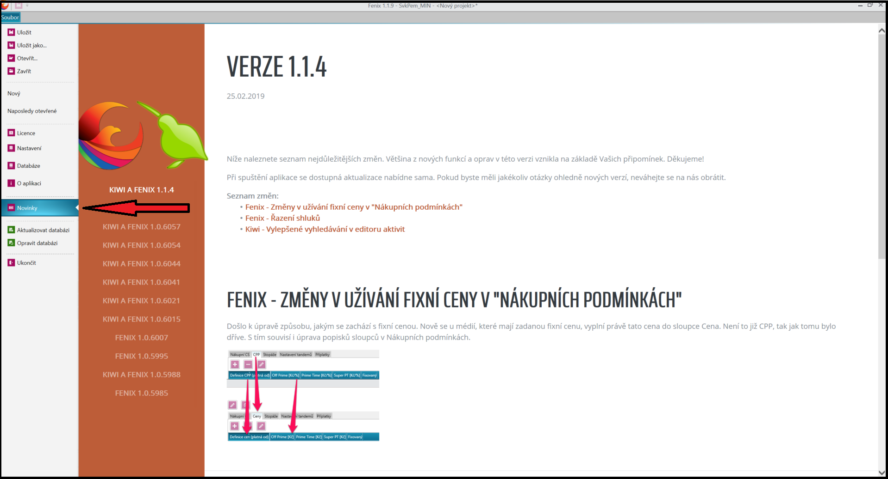

# Verze 1.1.9
07.03.2019

## Fenix/Kiwi - Novinky
Nově se aplikované úpravy a vylepšejí zobrazit na levé straně úvodního zobrazení Fenix na kartě "Novinky"

## Fenix - Ignorace speciálních znaků a interpunkcí v Duplicitních blocích
Došlo k úpravě ve vyhledávání duplicitních bloků. Nově se vyhledávají pořady pouze podle alfanumerických znaků. Spacialní znaky a interpunkce jsou ignorovány.
Pokud je na například na konci názvu bloku "/" a u jiného bloku stejného názvu není, tak jsou považovány za totožné.

## Fenix - Index zobrazující počet vybraných dnů
Při výběru dnů, týdnů, měsíců případně celého roku se vedle čísla měsíce zobrazuje i počet dní vybraných v tomto měsíci. 

## Fenix - Toleranceance u období při optimalizaci
Při nastavování "Prioryty za období" v optimalizaci detailního plánu lze nově nastavit toleranci u období v %.

## Fenix - Automatický import listu do šablony při importu z excelu
V okně "Šablony" u detailního plánu se při importu šablony z Excelu nově automaticky načítá název listu do vybrané šablony. Tato funkce je aktivní pouze u jednolistových excelových souborů.
V případě, že Excel obsahuje více listů, tak je nutné list vybrat ručně.

